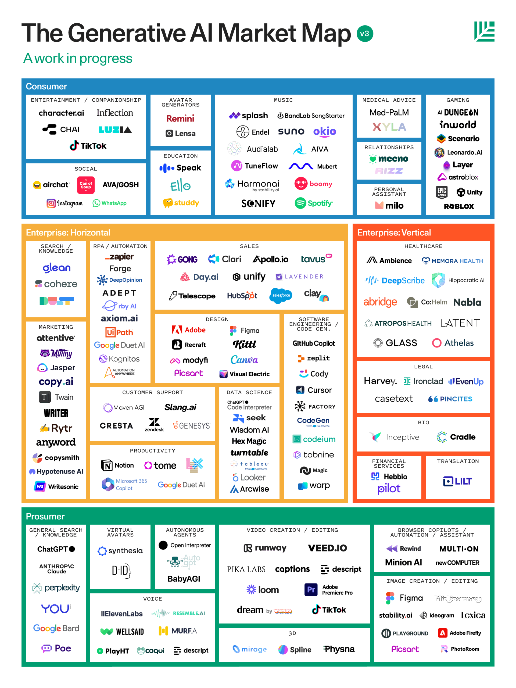
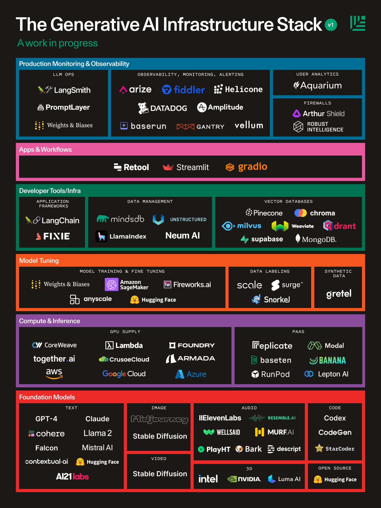
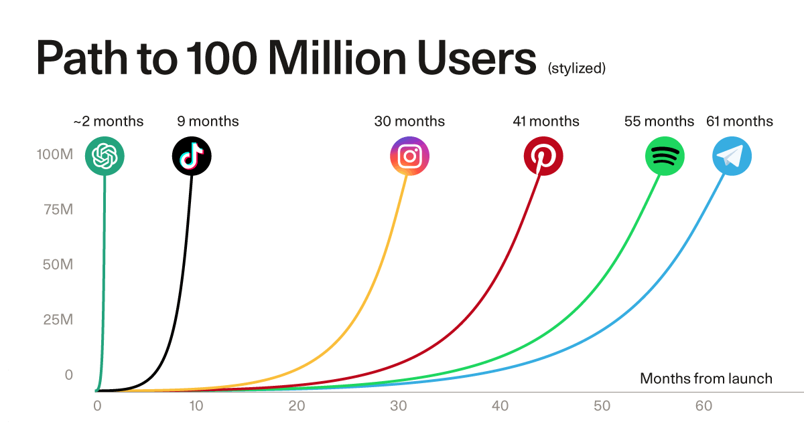
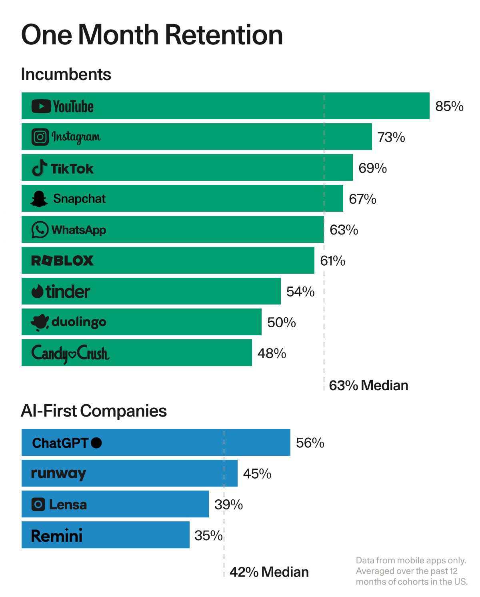
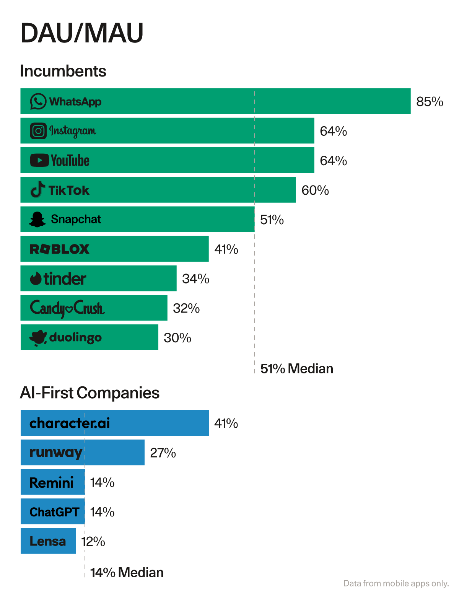

One year ago, we published a hypothesis that generative AI would become a profound platform shift in technology. Then came the firestorm.

<!--more-->

Scientists, historians and economists have long studied the optimal conditions that create a Cambrian explosion of innovation. In generative AI, we have reached a modern marvel, our generation’s space race.

This moment has been decades in the making. Six decades of Moore’s Law have given us the compute horsepower to process exaflops of data. Four decades of the internet (accelerated by COVID) have given us trillions of tokens’ worth of training data. Two decades of mobile and cloud computing have given every human a supercomputer in the palm of our hands. In other words, decades of technological progress have accumulated to create the necessary conditions for generative AI to take flight.

ChatGPT’s rise was the spark that lit the fuse, unleashing a density and fervor of innovation that we have not seen in years—perhaps since the early days of the internet. The breathless excitement was especially visceral in “Cerebral Valley,” where AI researchers reached rockstar status and hacker houses were filled to the brim each weekend with new autonomous agents and companionship chatbots. AI researchers transformed from the proverbial “hacker in the garage” to special forces units commanding billions of dollars of compute. The arXiv printing press has become so prolific that researchers have jokingly called for a pause on new publications so they can catch up.

But quickly, AI excitement turned to borderline hysteria. Suddenly, every company was an “AI copilot.” Our inboxes got filled up with undifferentiated pitches for “AI Salesforce” and “AI Adobe” and “AI Instagram.” The $100M pre-product seed round returned. We found ourselves in an unsustainable feeding frenzy of fundraising, talent wars and GPU procurement. 

And sure enough, the cracks started to show. Artists and writers and singers challenged the legitimacy of machine-generated IP. Debates over ethics, regulation and looming superintelligence consumed Washington. And perhaps most worryingly, a whisper began to spread within Silicon Valley that generative AI was not actually useful. The products were falling far short of expectations, as evidenced by terrible user retention. End user demand began to plateau for many applications. Was this just another vaporware cycle?

The AI summer of discontent has sent critics gleefully grave dancing, reminiscent of the early days of the internet, where in 1998 one famous economist declared “By 2005, it will become clear that the Internet’s impact on the economy has been no greater than the fax machine’s.”

Make no mistake—despite the noise and the hysteria and the air of uncertainty and discontent,  generative AI has already had a more successful start than SaaS, with >$1 billion in revenue from startups alone (it took the SaaS market years, not months, to reach the same scale). Some applications have become household names: ChatGPT became the fastest-growing application with particularly strong product-market fit among students and developers; Midjourney became our collective creative muse and was reported to have reached hundreds of millions of dollars in revenue with a team of just eleven; and Character popularized AI entertainment and companionship and created the consumer “social” application we craved the most—with users spending two hours on average in-app.

Nonetheless, these early signs of success don’t change the reality that a lot of AI companies simply do not have product-market fit or a sustainable competitive advantage, and that the overall ebullience of the AI ecosystem is unsustainable.

Now that the dust has settled for a bit, we thought it would be an opportune moment to zoom out and reflect on generative AI—where we find ourselves today, and where we’re possibly headed. 

## Towards Act Two

Generative AI’s first year out the gate—“Act 1”—came from the technology-out. We discovered a new “hammer”—foundation models—and unleashed a wave of novelty apps that were lightweight demonstrations of cool new technology. 

We now believe the market is entering “Act 2”—which will be from the customer-back. Act 2 will solve human problems end-to-end. These applications are different in nature than the first apps out of the gate. They tend to use foundation models as a piece of a more comprehensive solution rather than the entire solution. They introduce new editing interfaces, making the workflows stickier and the outputs better. They are often multi-modal.

The market is already beginning to transition from “Act 1” to “Act 2.” Examples of companies entering “Act 2” include Harvey, which is building custom LLMs for elite law firms; Glean, which is crawling and indexing our workspaces to make Generative AI more relevant at work; and Character and Ava, which are creating digital companions. 

## Market Map

Our updated generative AI market map is below. 

Unlike last year’s map, we have chosen to organize this map by use case rather than by model modality. This reflects two important thrusts in the market: Generative AI’s evolution from technology hammer to actual use cases and value, and the increasingly multimodal nature of generative AI applications.

In addition, we have included a new LLM developer stack that reflects the compute and tooling vendors that companies are turning to as they build generative AI applications in production.

## Revisiting Our Thesis

Our original essay laid out a thesis for the generative AI market opportunity and a hypothesis for how the market would unfold. How did we do?

Here’s what we got wrong:

1. Things happened quickly. Last year, we anticipated it would be nearly a decade before we had intern-level code generation, Hollywood-quality videos or human quality speech that didn’t sound mechanical. But a quick listen to Eleven Labs’ voices on TikTok or Runway’s AI film festival makes it clear that the future has arrived at warp speed. Even 3D models, gaming and music are becoming good, quickly. 
2. The bottleneck is on the supply side. We did not anticipate the extent to which end user demand would outstrip GPU supply. The bottleneck to many companies’ growth quickly became not customer demand but access to the latest GPUs from Nvidia. Long wait times became the norm, and a simple business model emerged: pay a subscription fee to skip the line and access better models. 
3. Vertical separation hasn’t happened yet. We still believe that there will be a separation between the “application layer” companies and foundation model providers, with model companies specializing in scale and research and application layer companies specializing in product and UI. In reality, that separation hasn’t cleanly happened yet. In fact, the most successful user-facing applications out of the gate have been vertically integrated.
4. Cutthroat competitive environment and swiftness of the incumbent response. Last year, there were a few overcrowded categories of the competitive landscape (notably image generation and copywriting), but by and large the market was whitespace. Today, many corners of the competitive landscape have more competition than opportunity. The swiftness of the incumbent response, from Google’s Duet and Bard to Adobe’s Firefly—and the willingness of incumbents to finally go “risk on”—has magnified the competitive heat. Even in the foundation model layer, we are seeing customers set up their infrastructure to be agnostic between different vendors. 
5. The moats are in the customers, not the data. We predicted that the best generative AI companies could generate a sustainable competitive advantage through a data flywheel: more usage → more data → better model → more usage. While this is still somewhat true, especially in domains with very specialized and hard-to-get data, the “data moats” are on shaky ground: the data that application companies generate does not create an insurmountable moat, and the next generations of foundation models may very well obliterate any data moats that startups generate. Rather, workflows and user networks seem to be creating more durable sources of competitive advantage.

Here’s what we got right:

1. Generative AI is a thing. Suddenly, every developer was working on a generative AI application and every enterprise buyer was demanding it. The market even kept the “generative AI” moniker. Talent flowed into the market, as did venture capital dollars. Generative AI even became a pop culture phenomenon in viral videos like “Harry Potter Balenciaga” or the Drake imitation song “Heart on My Sleeve” by Ghostwriter which has become a chart-topping hit.
2. The first killer apps emerged. It’s been well documented that ChatGPT was the fastest application to reach 100M MAU—and it did so organically in just 6 weeks. By contrast, Instagram took 2.5 years, WhatsApp took 3.5 years, and YouTube and Facebook took 4 years to reach that level of user demand. But ChatGPT is not an isolated phenomenon. The depth of engagement of Character AI (2 hour average session time), the productivity benefits of Github Copilot (55% more efficient), and the monetization path of Midjourney (hundreds of millions of dollars in revenue) all suggest that the first cohort of killer apps has arrived.
3. Developers are the key. One of the core insights of developer-first companies like Stripe or Unity has been that developer access opens up use cases you could not even imagine. In the last several quarters, we have been pitched everything from music generation communities to AI matchmakers to AI customer support agents.
4. The form factor is evolving. The first versions of AI applications have largely been autocomplete and first drafts, but these form factors are now growing in complexity. Midjourney’s introduction of camera panning and infilling is a nice illustration of how the generative AI-first user experience has grown richer. Across the board, form factors are evolving from individual to system-level productivity and from human-in-the-loop to execution-oriented agentic systems.
5. Copyright and ethics and existential dread. The debate has roared on these hot-button topics. Artists and writers and musicians are split, with some creators rightfully outraged that others are profiting off derivative work, and some creators embracing the new AI reality (Grimes’ profit-sharing proposition and James Buckhouse’s optimism about becoming part of the creative genome come to mind). No startup wants to be the Napster or Limewire to the eventual Spotify (h/t Jason Boehmig). The rules are opaque: Japan has declared that content used to train AI has no IP rights, while Europe has proposed heavy-handed regulation. 

## Where do we stand now? Generative AI’s Value Problem

Generative AI is not lacking in use cases or customer demand. Users crave AI that makes their jobs easier and their work products better, which is why they have flocked to applications in record-setting droves (in spite of a lack of natural distribution). 

But do people stick around? Not really. The below chart compares the month 1 mobile app retention of AI-first applications to existing companies. 

User engagement is also lackluster. Some of the best consumer companies have 60-65% DAU/MAU; WhatsApp’s is 85%. By contrast, generative AI apps have a median of 14% (with the notable exception of Character and the “AI companionship” category). This means that users are not finding enough value in Generative AI products to use them every day yet.

In short, generative AI’s biggest problem is not finding use cases or demand or distribution, it is proving value. As our colleague David Cahn writes, “the $200B question is: What are you going to use all this infrastructure to do? How is it going to change people’s lives?” The path to building enduring businesses will require fixing the retention problem and generating deep enough value for customers that they stick and become daily active users.

Let’s not despair. Generative AI is still in its “awkward teenage years.” There are glimpses of brilliance, and when the products fall short of expectations the failures are often reliable, repeatable and fixable. Our work is cut out for us. 

## Act Two: A Shared Playbook

Founders are embarking on the hard work of prompt engineering, fine tuning and dataset curation to make their AI products *good*. Brick by brick, they are building flashy demos into whole product experiences. And meanwhile, the foundation model substrate continues to brim with research and innovation.

A shared playbook is developing as companies figure out the path to enduring value. We now have shared techniques to make models useful, as well as emerging UI paradigms that will shape generative AI’s second act.

### The Model Development Stack

- Emerging reasoning techniques like chain-of-thought, tree-of-thought and reflexion are improving models’ ability to perform richer, more complex reasoning tasks, closing the gap between customer expectations and model capabilities. Developers are using frameworks like Langchain to invoke and debug more complex multi-chain sequences.
- Transfer learning techniques like RLHF and fine-tuning are becoming more accessible, especially with the recent availability of fine-tuning for GPT-3.5 and Llama-2, which means that companies can adapt foundation models to their specific domains and improve from user feedback. Developers are downloading open-source models from Hugging Face and fine-tuning them to achieve quality performance.
- Retrieval-augmented generation is bringing in context about the business or the user, reducing hallucinations and increasing truthfulness and usefulness. Vector databases from companies like Pinecone have become the infrastructure backbone for RAG.
- New developer tools and application frameworks are giving companies reusable building blocks to create more advanced AI applications and helping developers evaluate, improve and monitor the performance of AI models in production, including LLMOps tools like Langsmith and Weights & Biases 
- AI-first infrastructure companies like Coreweave, Lambda Labs, Foundry, Replicate and Modal are unbundling the public clouds and providing what AI companies need most: plentiful GPUs at a reasonable cost, available on-demand and highly scalable, with a nice PaaS developer experience.

Together, these techniques should close the expectations vs reality gap for models as the underlying foundation models simultaneously improve. But making the models great is only half the battle. The playbook for a generative AI-first user experience is evolving as well:

### Emerging Product Blueprints

- Generative interfaces. A text-based conversational user experience is the default interface on top of an LLM. Gradually, newer form factors are entering the arsenal, from Perplexity’s generative user interfaces to new modalities like human-sounding voices from Inflection AI. 
- New editing experiences: from Copilot to Director’s Mode. As we advance from zero-shot to ask-and-adjust (h/t Zach Lloyd), generative AI companies are inventing a new set of knobs and switches that look very different from traditional editing workflows. Midjourney’s new panning commands and Runway’s Director’s Mode create new camera-like editing experiences. Eleven Labs is making it possible to manipulate voices through prompting.
- Increasingly sophisticated agentic systems. Generative AI applications are increasingly not just autocomplete or first drafts for human review; they now have the autonomy to problem-solve, access external tools and solve problems end-to-end on our behalf. We are steadily progressing from level 0 to level 5 autonomy. 
- System-wide optimization. Rather than embed in a single human user’s workflow and make that individual more efficient, some companies are directly tackling the system-wide optimization problem. Can you pick off a chunk of support tickets or pull requests and autonomously solve them, thereby making the whole system more effective?

## Parting Thoughts

As we approach the frontier paradox and as the novelty of transformers and diffusion models dies down, the nature of the generative AI market is evolving. Hype and flash are giving way to real value and whole product experiences.

At Sequoia we remain steadfast believers in generative AI. The necessary conditions for this market to take flight have accumulated over the span of decades, and the market is finally here. The emergence of killer applications and the sheer magnitude of end user demand has deepened our conviction in the market.

However, Amara’s Law—the phenomenon that we tend to overestimate the effect of a technology in the short run and underestimate the effect in the long run—is running its course. We are applying patience and judgment in our investment decisions, with careful attention to how founders are solving the value problem. The shared playbook companies are using to push the boundaries on model performance and product experiences gives us optimism on generative AI’s second act.

> This article is from [Sequoia Capital](https://www.sequoiacap.com/article/generative-ai-act-two/)
